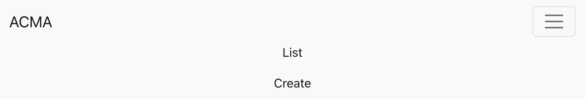
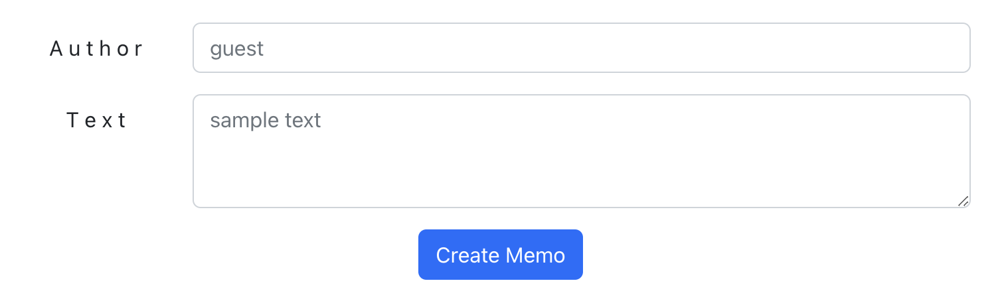
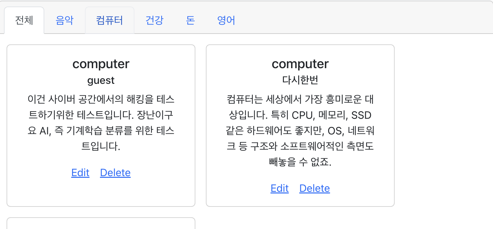

# 📝 ACMA (Auto Classifying Memo App)

주제별로 자동 분류되는 메모 앱

## 설명

인생 계획부터 이번 주 쇼핑 리스트까지, 정신없이 뒤죽박죽 섞여있는 내 네모 앱이  자동으로 정리되었으면 하는 마음에서 시작한 프로젝트입니다. 
 
#### MENU

메뉴 구성은 위와 같습니다.
 
#### CREATE

Create를 통해 작성자와 텍스트만 입력하면 메모를 생성할 수 있습니다.
 
#### LIST

List에 추가될 때는 자동으로 카테고리가 분류되어 들어가는 것을 확인할 수 있습니다.  List 내 카테고리 탭을 클릭하면 분류된 주제별로 묶어서 볼 수 있습니다.

## 원리

- 접근 보안을 위해 secret token을 발행하여 식별자로 사용합니다.
- 한글로 된 메모를 영어 NLP 모델에 처리하기 위해 Google Translation API를 활용합니다. 
- HuggingFace에서 제공하는 transformers의 "Zero Shot Classification" pipeline을 활용합니다. 
 
주요 모델인 Memo 객체의 변화를 도식화하면 위와 같습니다.

## 기술스택

